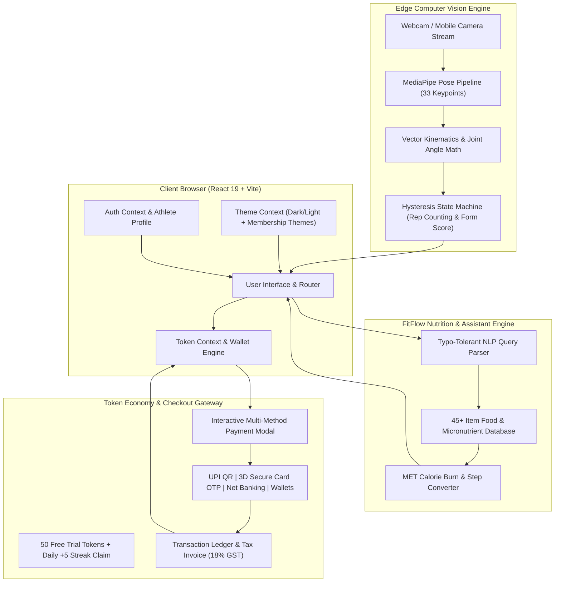
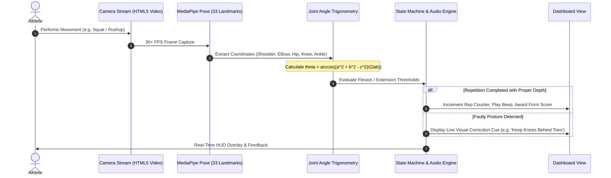
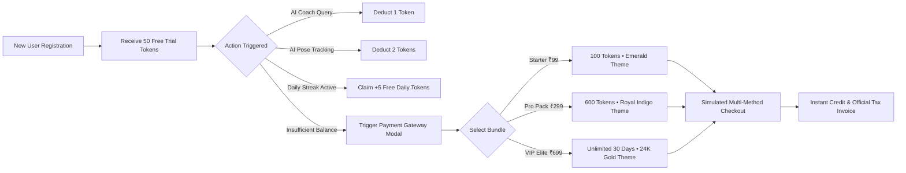

# ⚡ FitFlow AI — Intelligent Motion Tracker & SaaS Fitness Platform

<div align="center">

[](https://react.dev/)
[](https://vitejs.dev/)
[](https://www.tensorflow.org/js)
[](https://developers.google.com/mediapipe)
[](https://tailwindcss.com/)
[](https://opensource.org/licenses/MIT)

**Edge Computer Vision • Real-Time Joint Kinematics • Macro Nutrition Engine • Token Economy & Multi-Method Checkout**

[Explore Live Demo](https://riteshkumxr.github.io/Fitflow_Excercise_Master/) • [Report Bug](https://github.com/riteshkumxr/Fitflow_Excercise_Master/issues) • [Request Feature](https://github.com/riteshkumxr/Fitflow_Excercise_Master/issues)

</div>

---

## 🌟 Overview

**FitFlow AI** is an advanced, client-side computer vision fitness coaching platform that turns any standard webcam or smartphone camera into an intelligent personal trainer. Running entirely in the browser using **MediaPipe Pose** and **TensorFlow.js**, it tracks 33 skeletal landmarks in real-time, validates biomechanical joint angles, counts exercise repetitions, and calculates form accuracy scores with **zero cloud inference cost or latency**.

Beyond motion tracking, FitFlow features an integrated **SaaS Token Economy**, dynamic **Multi-Tier Memberships** with individualized color palettes, simulated **Multi-Method Payment Gateway** (UPI QR, 3D Secure Cards, Net Banking) with automated GST invoicing, and an intelligent **NLP Nutrition Engine**.

---

## 🏗️ System Architecture Pipeline



---

## 🔬 Computer Vision Pose Tracking Pipeline

FitFlow runs real-time kinematic calculations directly on client hardware (WebGL accelerated) without transmitting video frames to a remote server, ensuring total user privacy.



---

## 💳 Token Economy & Payment Workflow



---

## 🎨 Unique Multi-Tier Membership Themes

Every membership tier in FitFlow features a distinct color theme that dynamically styles the entire application:

| Membership Tier | Pricing & Bundle | Unique Color Theme | Visual Palette & Experience |
| :--- | :--- | :--- | :--- |
| **Starter Booster** | **₹99** / 100 Tokens | **Electric Mint & Emerald** ⚡ | Fresh emerald borders, neon cyan highlights, mint badge, emerald checkout accents. |
| **Pro Athlete Pack** | **₹299** / 600 Tokens | **Royal Indigo & Electric Violet** 🔥 | Royal indigo borders, fiery gradient badge, +100 bonus token indicator, performance athlete styling. |
| **Unlimited VIP Elite** | **₹699** / Month | **Ultra-Luxury 24K Royal Gold & Obsidian** 👑 | 24K gold borders, liquid amber gradients, golden Crown badge (`👑 30-DAY VIP PASS`), gold price glow, and golden VIP Aura throughout the Navbar, Profile, and Checkout. |

---

## 🚀 Complete Feature Highlights

- **⚡ Real-Time Pose Tracking**: 12 dedicated computer vision modules (Squats, Pushups, Pullups, Shoulder Press, Bicep Curls, Lateral Raises, Lunges, Good Mornings, High Knees, and Seated Desk Mobility exercises).
- **🎬 13 Biomechanically Unique Demonstrations**: Replaced generic placeholders with dedicated, accurate exercise demonstration animations.
- **🤖 NLP Fitness & Nutrition Engine**: Typo-tolerant natural language search supporting 45+ Indian and global foods (samosa, roti, paneer, biryani, whey, creatine, etc.) with exact calorie-to-exercise burn equivalents.
- **💰 SaaS Token Economy**: 50 free starter tokens, daily streak refills, and dynamic feature paywalls.
- **💳 Multi-Method Payment Simulation**: Supports UPI Dynamic QR, Credit/Debit Cards with 3D Secure OTP verification, Net Banking (HDFC, SBI, ICICI, etc.), and Wallets, complete with printable 18% GST tax invoices.
- **🌓 Accessible Dark & Light Modes**: 
  - High-visibility pill toggle in the Navigation Bar.
  - Dedicated theme switch card in the mobile drawer.
  - Quick-access Hero button + **floating theme pill** on the Home page (`Dashboard.jsx`).
  - Preferences control card in the Athlete Profile.
- **📱 100% Responsive Architecture**: Optimized across mobile smartphones (360px–430px), tablets (768px–1024px), and ultra-wide desktops.
- **👤 Athlete Profile Hub**: Customizable user vitals, photo avatar upload with client-side canvas compression, global leaderboard, and consultation schedule.

---

## 🛠️ Technology Stack

| Domain | Technologies Used |
| :--- | :--- |
| **Frontend Framework** | React 19, Vite 6.2, React Router DOM 7 |
| **Styling & Design** | Tailwind CSS 3.4, Lucide React Icons |
| **AI & Computer Vision** | MediaPipe Pose, TensorFlow.js (WebGL backend) |
| **State Management** | Context API (`AuthContext`, `ThemeContext`, `TokenContext`) |
| **Storage & Security** | LocalStorage state persistence, Base64 compressed image storage |

---

## 🏃 Getting Started

### Prerequisites
- Node.js (v18.0.0 or higher)
- Modern web browser with camera permissions enabled (Chrome, Firefox, Safari, Edge)

### Installation
```bash
# 1. Clone repository
git clone https://github.com/riteshkumxr/Fitflow_Excercise_Master.git

# 2. Enter project folder
cd Fitflow_Excercise_Master

# 3. Install dependencies
npm install

# 4. Launch local development server
npm run dev
```

Open [http://localhost:5173/Fitflow_Excercise_Master/](http://localhost:5173/Fitflow_Excercise_Master/) in your browser.

### Building for Production
```bash
npm run build
```

---

## 👨‍💻 Author & Connect

**Ritesh Kumar**  
- **GitHub**: [@riteshkumxr](https://github.com/riteshkumxr)  
- **LinkedIn**: [Connect on LinkedIn](https://linkedin.com/in/riteshkumar)  
- **Portfolio**: [FitFlow Live Deployment](https://riteshkumxr.github.io/Fitflow_Excercise_Master/)

---

## 📄 License

This project is licensed under the **MIT License** — see the [LICENSE](LICENSE) file for details.
